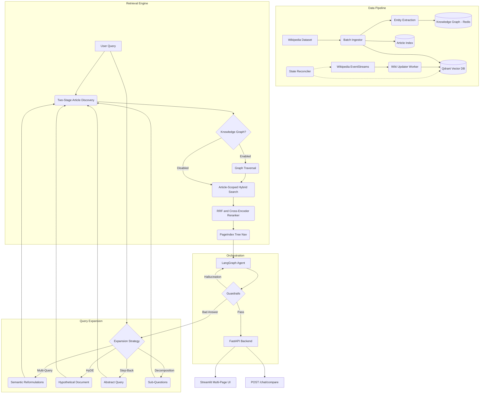

# WikiMind: Production-Grade Agentic Hybrid RAG Pipeline

WikiMind is a production-grade, end-to-end Agentic Hybrid RAG pipeline built on the complete English Wikipedia dataset. It features two-stage local retrieval, a self-healing knowledge base synced with live Wikipedia edits, entity-based knowledge graph traversal, temporal versioning with time-travel queries, an automated evaluation harness, and a multi-page Streamlit dashboard -- all orchestrated by a LangGraph CRAG/Self-RAG state machine.

## Architecture



## Features

| Feature | Description | Tech |
|---------|-------------|------|
| **Two-Stage Hybrid Retrieval** | Local article-level index for discovery, then article-scoped Dense + Sparse (BM25) + RRF + Cross-Encoder search | Qdrant, FastEmbed, FlashRank |
| **Knowledge Graph Traversal** | spaCy NER extracts entities from chunks; NetworkX co-occurrence graph enables multi-hop reasoning | spaCy, NetworkX, Redis |
| **Temporal Versioning** | Tracks `revision_id`, `ingested_at`, and `is_current` per chunk; supports time-travel queries via date picker | Qdrant payload indices |
| **Self-Healing Sync** | Wikimedia EventStreams SSE listener with version-aware upserts and true revision comparison reconciler | aiohttp, MediaWiki API |
| **Agentic Loops** | LangGraph state machine with CRAG grading, Self-RAG hallucination detection, and conditional graph search routing | LangGraph, LangChain |
| **Query Expansion** | Parallel strategies: Multi-Query, HyDE, Step-Back Abstraction, Query Decomposition | LangChain, OpenAI |
| **Evaluation Harness** | Automated benchmarking with Recall@K, MRR, Answer Accuracy, and latency percentiles against NQ and TriviaQA | HuggingFace Datasets |
| **A/B Dashboard** | Side-by-side strategy comparison (single-query and batch CSV) with metrics visualization | Streamlit |
| **Safe Generation** | NeMo Guardrails for hallucination detection and output safety | NeMo Guardrails |
| **Full Observability** | Distributed tracing, hardware metrics, and LLM telemetry | Langfuse, Prometheus, Grafana |

## Project Structure

```
wikimind/
|-- backend/
|   |-- agent.py              # LangGraph state machine (10 nodes)
|   |-- article_index.py      # Stage 1: article-level retrieval
|   |-- knowledge_graph.py    # spaCy NER + NetworkX graph + Redis
|   |-- retrieval.py          # Stage 2: hybrid search + time-travel
|   |-- query_expansion.py    # Multi-Query, HyDE, Step-Back, Decomposition
|   |-- page_index.py         # Vectorless structural navigation
|   |-- cache.py              # Redis semantic cache
|   |-- main.py               # FastAPI app with /chat, /chat/compare, /health
|   |-- models.py             # Pydantic request/response schemas
|   |-- config.py             # Settings management
|   |-- llmops.py             # Langfuse integration
|   |-- qdrant_client.py      # Collection init with temporal indices
|   +-- guardrails_config/    # NeMo Guardrails configuration
|-- data_pipeline/
|   |-- ingest.py             # Batch ingestion with entity extraction
|   |-- wiki_updater.py       # Live SSE listener with version-aware upserts
|   |-- reconciler.py         # Revision comparison drift detection
|   +-- graph_builder.py      # Knowledge graph builder from Qdrant chunks
|-- evaluation/
|   |-- harness.py            # CLI benchmark runner
|   |-- metrics.py            # Recall@K, MRR, accuracy, latency
|   |-- datasets.py           # NQ + TriviaQA loaders with caching
|   |-- report.py             # Markdown + JSON report generator
|   +-- configs/              # Preset configurations (baseline, no_reranker, with_expansion)
|-- frontend/
|   |-- app.py                # Multi-page Streamlit app entry point
|   +-- pages/
|       |-- ab_dashboard.py   # A/B strategy comparison
|       +-- eval_results.py   # Evaluation results browser
|-- monitoring/               # Prometheus and Grafana configuration
|-- docker-compose.yml
|-- pyproject.toml
+-- Makefile
```

## Quick Start

### Prerequisites

- Python 3.11+
- Docker and Docker Compose
- API Keys: OpenAI (required), Langfuse (optional)

### Setup

1. Clone the repository:
   ```bash
   git clone https://github.com/JayacharanR/WikiMind-End-to-End-Hybrid-RAG-Pipeline.git
   cd WikiMind-End-to-End-Hybrid-RAG-Pipeline
   ```

2. Copy `.env.example` to `.env` and fill in your API keys:
   ```bash
   cp .env.example .env
   ```

3. Start the entire stack:
   ```bash
   make dev
   ```

4. Access the application:
   - Streamlit UI: `http://localhost:8501`
   - FastAPI Docs: `http://localhost:8000/docs`
   - Grafana: `http://localhost:3000` (admin/admin)

### Build the Knowledge Graph

After ingesting data, build the entity co-occurrence graph:

```bash
python -m data_pipeline.graph_builder
```

### Run Evaluations

Benchmark the pipeline against Natural Questions or TriviaQA:

```bash
python -m evaluation.harness --dataset nq --subset 50
python -m evaluation.harness --dataset triviaqa --subset 100 --config evaluation/configs/with_expansion.json
```

## API Reference

### `POST /chat`

Streams the agent's thought process and final answer via SSE.

```json
{
  "query": "What is the capital of France?",
  "strategies": {
    "multi_query": true,
    "hyde": false,
    "step_back": false,
    "decomposition": false,
    "page_index": false,
    "knowledge_graph": true
  },
  "as_of_date": null
}
```

### `POST /chat/compare`

Runs a query through multiple strategy configurations for A/B comparison.

```json
{
  "query": "What is quantum entanglement?",
  "configs": [
    {"name": "Baseline", "multi_query": false, "hyde": false},
    {"name": "Multi-Query", "multi_query": true, "hyde": false}
  ]
}
```

### `GET /health`

Returns the status and latency of infrastructure components (Qdrant, Redis, Langfuse).

## Tech Stack

| Category | Technologies |
|----------|-------------|
| **LLM Orchestration** | LangGraph, LangChain, OpenAI |
| **Vector Database** | Qdrant (Dense + Sparse + RRF) |
| **Embeddings** | FastEmbed (BAAI/bge-small-en-v1.5) |
| **Knowledge Graph** | spaCy, NetworkX, Redis |
| **Reranking** | FlashRank (cross-encoder) |
| **Caching** | Redis (semantic cache + KG persistence) |
| **Guardrails** | NeMo Guardrails |
| **Observability** | Langfuse, Prometheus, Grafana |
| **Web Framework** | FastAPI, Streamlit |
| **Data Pipeline** | HuggingFace Datasets, aiohttp, MediaWiki API |
| **Evaluation** | Custom harness with NQ/TriviaQA datasets |

## License

[MIT](LICENSE)
