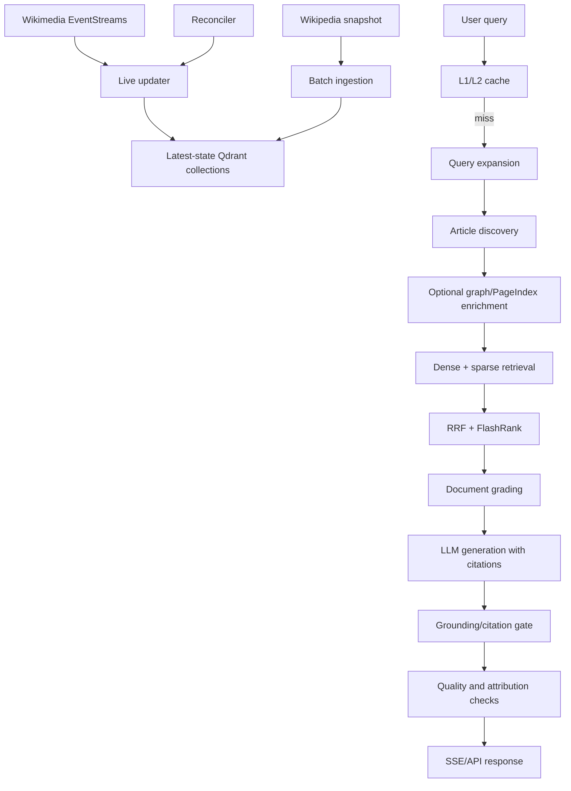

# WikiMind — End-to-End Hybrid RAG Pipeline

WikiMind is a portfolio-grade question-answering system grounded in English
Wikipedia. It demonstrates batch ingestion, latest-state synchronization,
two-stage hybrid retrieval, citation-aware generation, evaluation,
observability, and a Streamlit interface.

The project stores the latest indexed state of each article. Historical
versions are intentionally not retained. If an answer cannot be verified from
retrieved evidence, the agent abstains.

## Architecture



## Core behavior

### Retrieval

- Stage 1 searches one dense vector per article.
- Stage 2 searches only discovered articles with dense and sparse vectors.
- Qdrant performs Reciprocal Rank Fusion; FlashRank reranks candidates.
- Optional Multi-Query, HyDE, Step-Back, Decomposition, PageIndex, and
  knowledge-graph strategies are enabled per request.

### Freshness and latest-state consistency

- Batch ingestion stores `source_document_id` and `revision_source`.
- Live updates upsert deterministic new chunk IDs first, then remove stale IDs.
- Empty and deleted articles remove their chunk and article-index entries.
- Local Qdrant supports the same delete operations as remote mode.
- Redis knowledge-base generation invalidates answer caches after updates.
- The reconciler uses valid Qdrant cursors and reservoir sampling.
- Failed events enter a persisted, bounded dead-letter queue.

### Grounding and safety

- Factual claims must use valid `[N]` references.
- Out-of-range citations are rejected.
- Grounding-check failures fail closed.
- Ungrounded answers become abstentions after the retry budget.
- Retrieved text is explicitly marked as untrusted evidence.
- Optional `API_KEY`, rate limiting, and request deadlines protect chat routes.

## Repository layout

```text
backend/                FastAPI API and LangGraph RAG pipeline
data_pipeline/          Ingestion, live updater, reconciler, DLQ, graph builder
evaluation/              NQ/TriviaQA benchmark harness and reports
frontend/                Streamlit chat and evaluation pages
dashboard/               Static observability dashboard
tests/                   Automated regression tests
docker-compose.yml       Backend, frontend, workers, Qdrant, Redis, Langfuse
pyproject.toml           Runtime and development dependencies
```

## Local setup

Prerequisites: Python 3.11–3.13. Docker is optional for small local tests, but
recommended for the populated corpus because embedded Qdrant is not intended
for large collections.

```powershell
py -3.11 -m venv .venv
.\.venv\Scripts\Activate.ps1
python -m pip install -e ".[dev]"
python -m spacy download en_core_web_sm
Copy-Item .env.example .env
```

Set `OPENROUTER_API_KEY` in `.env`. Embeddings are local and do not require
an embedding API key. The default local Qdrant path is
`data/qdrant_storage`.

Use `QDRANT_MODE=local` when you want the embedded store at
`data/qdrant_storage`. Use `QDRANT_MODE=remote` with `QDRANT_URL` when using
the Docker Qdrant service. These are separate stores; switching modes does
not expose the other store's data.

### Local run

```powershell
python -m data_pipeline.ingest --max 1000 --batch 50
uvicorn backend.main:app --reload --port 8000
streamlit run frontend/app.py
```

Use `--max 0` for an unlimited snapshot ingestion. This requires substantial
time and storage. Checkpoints advance only after Qdrant acknowledges a batch.

### Docker run

```powershell
docker compose up -d --build
```

The compose file starts the backend, Streamlit frontend, updater, reconciler,
Qdrant, Redis Stack, Langfuse, and PostgreSQL. Image tags can be overridden
with `QDRANT_IMAGE`, `REDIS_IMAGE`, `LANGFUSE_IMAGE`, and
`POSTGRES_IMAGE`.

## API

### `POST /chat`

Returns SSE progress events and a final answer event.

```json
{
  "query": "What is the capital of France?",
  "strategies": {
    "multi_query": false,
    "hyde": false,
    "step_back": false,
    "decomposition": false,
    "page_index": false,
    "knowledge_graph": false
  }
}
```

Final metadata includes `retrieval_status`,
`article_discovery_status`, `provenance_score`, `attribution`, active
strategies, retries, and whether Guardrails generated the answer.

### `POST /chat/compare`

Runs two to five validated strategy configurations sequentially. All strategy
flags, including `knowledge_graph`, are preserved.

### Operational endpoints

- `GET /health` — Qdrant, Redis, and Langfuse status and latency.
- `GET /api/metrics` — in-process dashboard aggregates.
- `GET /api/traces?limit=100` — bounded trace history.
- `GET /api/pipeline-health` — updater and reconciler health/DLQ state.
- `GET /api/eval-results` — stored benchmark reports.

If `API_KEY` is set, send it as `X-API-Key` on chat routes. Set
`RATE_LIMIT_PER_MINUTE=0` only for controlled local testing.

## Testing

```powershell
python -m pytest
python -m ruff check .
python -m ruff format --check .
python -m compileall -q backend data_pipeline evaluation frontend tests
Get-ChildItem dashboard -Recurse -Filter *.js | ForEach-Object { node --check $_.FullName }
python -m data_pipeline.verify_pipeline
```

The unit suite covers local deletion forwarding, latest-state payload metadata,
citation rejection, hallucination abstention routing, cache partitioning, and
request validation. The verification suite supports local embedded Qdrant and
remote Qdrant; Redis is required for the cache integration cases.

When validating an existing embedded dataset, run the verifier with
`QDRANT_MODE=local`; when validating Docker services, use `QDRANT_MODE=remote`
and the service URL. The ingestion checkpoint is resumability metadata, not a
guarantee of the number of points currently present in Qdrant.

## Evaluation

```powershell
python -m evaluation.harness --dataset nq --subset 10
python -m evaluation.harness --dataset triviaqa --subset 10
```

Benchmark results depend on the indexed corpus, model, provider, and strategies.
Files in `evaluation/results/` are historical artifacts, not guarantees for
every deployment.

## Design boundaries

- Historical article versions are not retained.
- Latest-state replacement is not a distributed transaction across Qdrant and
  derived indexes; failures go to the DLQ and are retried.
- Dashboard traces are process-local and reset on restart; Langfuse/Prometheus
  are the durable observability paths.
- Pure-Redis semantic matching is bounded and O(n); RedisVL is preferred at
  larger cache sizes.
- Embedded Qdrant is convenient for development but is not the recommended
  deployment mode once the collection grows beyond a small test corpus.
- Production deployments should set `API_KEY` and use an ingress or gateway.

## License

[MIT](LICENSE)
